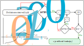

# Iskanje ničel funkcij

V tem projektu so implementirane tri metode za iskanje ničel funkcij. Torej iščemo vrednost $x$, za katero velja $f(x) = 0$. Ker pa to počnemo numerično, bomo pogoj nekoliko omilili in iskali vrednosti $x$, za katere velja
$$|f(x)| < \epsilon$$

, kjer je $\epsilon$ majhna pozitivna vrednost, ki določa natančnost iskanja ničel. V tem projektu so implementirane naslednje metode za iskanje ničel funkcij:

1. Metoda bisekcije
2. Sekantna metoda
3. Newtonova metoda

# 1. Metoda bisekcije

Metoda bisekcije je numerična metoda za iskanje ničel funkcij. Pri tej metodi iščemo ničlo funkcije znotraj določenega intervala $[a,b]$. Algoritem temelji na predpostavki, **da funkcija spremeni predznak**, ob prehodu skozi ničlo. To je tudi glavna zahteva in omejitev te metode, saj mora biti funkcija znotraj intervala $[a,b]$ neprekinjena in imeti različne predznake na koncih intervala.
posledično s to metodo ne moremo najti ničel funkcij, ki ne spreminjajo predznaka ali imajo več ničel znotraj intervala.


## 1.1 Algoritem bisekcije

1. Preverimo, ali funkcija $f$ spreminja predznak na interval $[a,b]$. Če ne, metoda ni primerna.
2. Izračunamo sredino intervala: $c = \frac{a + b}{2}$.
3. Preverimo vrednost funkcije na sredini intervala: $f(c)$.
4. Če je $|f(c)| < \epsilon$, smo našli ničlo in postopek končamo.
5. Če $f(c)$ in $f(a)$ imata različna predznaka, potem se ničla nahaja v intervalu $[a,c]$, zato nastavimo $b = c$.
6. Če $f(c)$ in $f(b)$ imata različna predznaka, potem se ničla nahaja v intervalu $[c,b]$, zato nastavimo $a = c$.
7. Ponovimo korake 2-3, dokler ne najdemo ničle ali dokler interval $[a,b]$ ni dovolj majhen.




# 2. Sekantna metoda

Sekantna metoda je podobna metodi bisekcije, vendar **ne zahteva, da funkcija spreminja predznak na začetnem intervalu**. Namesto tega uporablja dva začetna približka $x_0$ in $x_1$, ki sta blizu ničle, in nato iterativno izboljšuje približek z uporabo **sekantne črte**, ki povezuje točki $(x_0, f(x_0))$ in $(x_1, f(x_1))$. Algoritem se nadaljuje, dokler ne najdemo ničle ali dokler se približki ne konvergirajo.

Stabilnost metode je odvisna od izbire začetnih približkov, zato je pomembno, da so ti dovolj blizu dejanske ničle. Ker metoda uporablja sekantno črto, lahko včasih konvergira hitreje kot metoda bisekcije, vendar pa ni zagotovljena konvergenca in lahko v nekaterih primerih divergirajo. Pogoj za konvergenco je, da funkcija ni preveč ukrivljena v bližini ničle, kar pomeni, da mora biti drugi odvod funkcije majhen. Numerično lahko spremljamo stabilnost metode z analizo hitrosti konvergence in spremljanjem sprememb v približkih.

## 2.1 Algoritem sekantne metode

1. Izberemo dva začetna približka $x_0$ in $x_1$, ki sta blizu ničle.
2. Izračunamo vrednosti funkcije na teh približkih: $f(x_0)$ in $f(x_1)$.
3. Izračunamo nov približek $x_2$ z uporabo formule: $x_2 = x_1 - \frac{f(x_1)(x_1 - x_0)}{f(x_1) - f(x_0)}$.
4. Preverimo, ali je $|f(x_2)| < \epsilon$. Če je, smo našli ničlo in postopek končamo.
5. Posodobimo približke: $x_0 = x_1$ in $x_1 = x_2$.
6. Ponovimo korake 2-5, dokler ne najdemo ničle ali dokler se približki ne konvergirajo.


V datoteki `funkcije.h` se nahajajo definicije funkcij, ki se uporabljajo pri izvajanju metod.

## Primer uporabe

V datoteki `main.cpp` je napisan primer uporabe, kjer se za funkcije sproti preverja, če so začetni pogoji primerni in se nato po potrebi uporabi ena od treh metod za iskanje ničel. Nato se izpišejo najdene ničle za vsako funkcijo.

```c++
double a, b;

a = -10.0;
b = 10.0;

int metoda = 2;
int N = 100000;

for (int i = 1; i < 5; i++) {
    int OK = preveri_init(a, b, i, metoda, N);
    printf("%d\n", OK);
}
```

V tem primeru se najprej določi interval $[a,b]$ v katerem bomo iskali ničle, nato se določi metoda za iskanje ničel in končno se za vsako funkcijo preveri, če so začetni pogoji primerni in se po potrebi uporabi izbrana metoda za iskanje ničel. Funkcija `preveri_init` izpiše število najdenih ničel in vrednosti najdenih ničel.


# Domača naloga

1. Izstrelek se nahaj na klancu, ki ima naklon $\varphi = 20°$ pod kotom $\alpha = 30°$, glede na klanec izstrelimo telo. Izstrelimo ga z začetno hitrostjo $v_0 = 100$ m/s. Določite čas, ko bo izstrelek dosegel tla, in razdaljo od izstrelka do točke, kjer bo izstrelek dosegel tla. Upoštevajte gravitacijski pospešek $g = 9.81$ m/s². Nalogo rešite analitično, nato pa še numerično z uporabo vseh treh metod za iskanje ničel funkcij. Primerjajte rezultate in natančnost vsake metode.