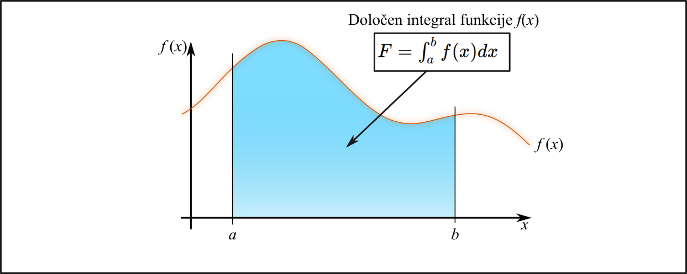
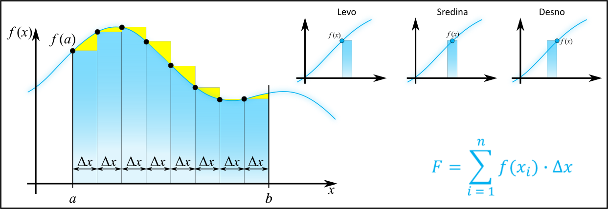
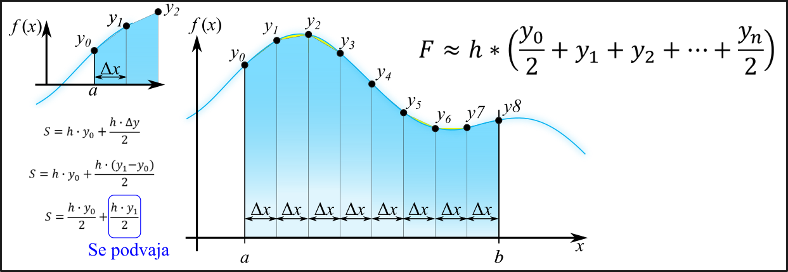
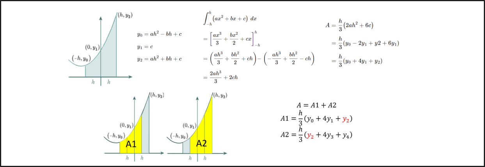

# VAJE 02: Numerično odvajanje in integriranje

Ta del je posvečen implementaciji in analizi numeričnih metod za **odvajanje** in **integriranje** funkcij. Metode temeljijo na aproksimaciji funkcij s pomočjo Taylorjeve vrste in delitvi intervalov na manjše dele.

## 1. Numerično odvajanje

Numerično odvajanje omogoča izračun odvoda funkcije $f(x)$ v točki $a$ z uporabo diskretnih vrednosti funkcije v okolici te točke. Napako pri tej metodi lahko ocenimo z uporabo Taylorjevega razvoja. Taylorjeva vrsta funkcije $f(x)$ okoli točke $a$ je dana z:

$$ f(a+h) = f(a) + f'(a) h + \frac{f''(a)}{2!}h^2 + \frac{f'''(a)}{3!} h^3 + \frac{f^{(4)}(a)}{4!} h^4 + \dots $$

Ker pri določanju odvoda uporabljamo končno število razlik, lahko to metodo imenujemo tudi metoka **končnih razlik**. Napaka pri tej metodi je odvisna od velikosti intervala $h$ in reda metode, ki jo uporabljamo.

Če pri določanju odvoda uporabimo $n$-točkovno metodo, potem je napaka reda $h^m$, kjer je $m$ odvisen od števila točk in načina aproksimacije. Na primer, za eno-stranski odvod je napaka reda $h$, za dvo-stranski odvod je napaka reda $h^2$, in tako naprej. Kot primer to pokažimo za eno-stranski odvod:

$$ f(x_0 + h) = f(x_0) + h f'(x_0) + \underbrace{\frac{h^2}{2} f''(x_0) + \dots}_{\mathcal{O}(h^2)} $$

Tukaj člen $\mathcal{O}(h^2)$ predstavlja napako metode, ki je reda $h^2$. To pomeni, da se napaka zmanjšuje kvadratno, ko se $h$ zmanjšuje.

Če bi uporabili dvo-stranski odvod, bi imeli:

$$ f(x_0 + h) = f(x_0) + h f'(x_0) + \underbrace{\frac{h^2}{2} f''(x_0) + \frac{h^3}{6} f'''(x_0) + \dots}_{\mathcal{O}(h^3)} $$

Tukaj člen $\mathcal{O}(h^3)$ predstavlja napako metode, ki je reda $h^3$. To pomeni, da se napaka zmanjšuje kubno, ko se $h$ zmanjšuje.

Pri vajah bomo uporabili tri različne metode za numerično odvajanje, ki se razlikujejo po natančnosti in številu uporabljenih točk. Vsaka metoda ima svoje prednosti in slabosti, zato je pomembno razumeti, kako se napaka spreminja z zmanjševanjem intervala $h$. Uporabili bomo:

- **Eno-stranski odvod (Forward Difference):** Uporablja dve točki in ima napako reda $h$.
$$ f'(x) \approx \frac{f(x+h)-f(x)}{h} $$

- **Dvo-stranski odvod (Central Difference):** Uporablja točke na obeh straneh intervala, kar poveča natančnost na red $h^2$.
$$ f'(x) \approx \frac{f(x+h)-f(x-h)}{2h} $$

- **Središčna diferenca (Central Difference):** Uporablja tri točke in ima napako reda $h^4$, kar omogoča še bolj natančno aproksimacijo odvoda.
$$f'(x)\approx \frac{f(x+h)+f(x-h)-2*f(x)}{4h}$$

- **Drugi odvod:** Omogoča izračun ukrivljenosti funkcije in ima napako reda $h^2$.
$$f''(x) \approx \frac{f(x+h)+f(x-h)-2*f(x)}{h^2}$$

### Naloga 1.1: Implementacija numeričnega odvajanja

Ustvari header file imenovan `numerical_differentiation.h`, ki vsebuje deklaracije funkcij za izračun odvoda in druge potrebne funkcije. Implementiraj funkcije v `numerical_differentiation.cpp`. Pri vsaki funkciji poskrbi za ustrezno dokumentacijo, ki pojasnjuje vhodne parametre, izhodne vrednosti in morebitne napake.

### Naloga 1.2: Analiza napake
Za funkcijo $f(x) = \sin(x)$ izračunaj vrednost odvoda v točki $x = 0,5$. Uporabi geometrijsko zaporedje $h_{n+1} = f \cdot h_n$, da razdeliš interval $h \in [10^{-6}, 1]$ na $M$ vrednosti. Izračunaj napako vsake metode glede na analitično vrednost odvoda in prikaži rezultate v tabeli. Analiziraj, kako se napaka spreminja z zmanjševanjem $h$ in primerjaj rezultate med različnimi metodami.

### Naloga 1.3: Napaka pri numeričnem odvajanju v intervalu
Za isto funkcijo $f(x) = \sin(x)$ numerično določite vrednosti odvodov v intervalu $x \in [0,2\pi]$. Interval od 0 do $2\pi$ razdelite na $N$ delov. V datoteko si sprotno zapisujte vrednosti za $x$, numerično določene vrednosti odvodov, analitično določene vrednosti odvodov ter absolutne napake. Rezultate izvozite v datoteko in jih prikaži v grafu.

## 2. Numerično integriranje

Določen integral funkcije $f(x)$ na intervalu $[a, b]$ lahko zapišemo kot:

$$ F = \lim_{n \to \infty} \sum_{i=1}^n f(x_i) \Delta x = \int_a^b f(x) dx $$

Vendar v praksi pogosto ne moremo izračunati neskončne vsote, zato uporabimo numerične metode za približevanje integrala.

Določeni integral funkcije $f(x)$ na intervalu $[a, b]$ je limita vsote, kjer gredo širine delnih intervalov $\Delta x$ proti nič. Nabor osnovnih metod za numerično integriranje vključuje:

- **Pravilo pravokotnikov:** To je osnovna ideja integriranja, kjer površino pod krivuljo aproksimiramo s seštevkom ploščin pravokotnikov širine $h$.

$$ F = \sum_{i=1}^n f(x_i) \Delta x$$

- **Trapezno pravilo:** Ta metoda bolje opiše trend funkcije znotraj intervala $h$ tako, da namesto pravokotnikov uporabi trapeze.
- 
$$ F = \frac{y_0 \cdot h}{2}  + h \sum_{i=1}^{n-1} f(x_i) +  \frac{y_n \cdot h}{2}$$

 

- **Simpsonovo pravilo:** Za še natančnejšo aproksimacijo trenda znotraj intervala $h$ uporabimo kvadratno enačbo (parabolo).

### Naloga 2.1: Implementacija numeričnega integriranja

Ustvari header file imenovan `numerical_integration.h`, ki vsebuje deklaracije funkcij za izračun integrala in druge potrebne funkcije. Implementiraj funkcije v `numerical_integration.cpp`. Pri vsaki funkciji poskrbi za ustrezno dokumentacijo, ki pojasnjuje vhodne parametre, izhodne vrednosti in morebitne napake.

### Naloga 2.2: Analiza napake

Za funkcije $f(x) = sin(x)$, $g(x) = x^2$ in $h(x) = e^x sin(x)$ izračunaj vrednost določenega integrala na intervalu $[-1, 1]$ z uporabo vseh treh metod.

- Uporabi geometrijsko zaporedje $h_{n+1} = f \cdot h_n$, da razdelite interval $h \in [10^{-6}, 1]$ na $M$ vrednosti. Izračunaj napako vsake metode glede na analitično vrednost integrala in prikaži rezultate v tabeli.
- Analiziraj, kako se napaka spreminja z zmanjševanjem $h$ in primerjaj rezultate med različnimi metodami.

## SAMOSTOJNO DELO: Fizikalne aplikacije numeričnih metod

Namen samostojnega dela je preizkusiti stabilnost in natančnost implementiranih algoritmov na realnih fizikalnih podatkih in funkcijah.

## Naloga 2.1: Delo pri raztezanju nestlinearne vzmeti

Sila nelinearne vzmeti je podana z enačbo: $F(x) = k_1 x + k_2 x^3$. Uporabite podatke $k_1 = 100\,\text{N/m}$, $k_2 = 500\,\text{N/m}^3$.

Izračunajte opravljeno delo $W = \int_{x_1}^{x_2} F(x) dx$ pri raztezku od $x_1 = 0$ do $x_2 = 0.2\,\text{m}$. Izvedite integracijo z uporabo trapeznega in Simpsonovega pravila. Preverite, kako hitro rezultat konvergira proti analitični rešitvi pri povečevanju števila delitev $N$ (npr. $N = 10, 100, 1000$).

## Naloga 2.2: Toplotna kapaciteta (Debyejev model)
V termodinamiki je notranja energija kristala povezana z integralom:

$$U(T) = C \int_{0}^{x_D} \frac{x^3}{e^x - 1} dx$$

Izračunajte vrednost integrala za zgornjo mejo $x_D = 1$ (nizke temperature). Funkcija v spodnji meji ($x=0$) na prvi pogled ni definirana ($0/0$). Uporabite numerični trik (npr. začnite integracijo pri $\epsilon = 10^{-10}$) ali L'Hôpitalovo pravilo. Uporabitte vsaj dve različni metodi za numerično integriranje in primerjajte rezultate. Analizirajte, kako se rezultat spreminja z zmanjševanjem $\epsilon$ in povečevanjem števila delitev $N$.

## Naloga 2.3: Iskanje ničel s pomočjo numeričnega odvoda

V fiziki pogosto iščemo ravnovesne lege (npr. kjer je sila $F = - \frac{dU}{dx} = 0$). Potencial med dvema atomoma lahko opišemo z Lennard-Jones potencialom:
$$ U(r) = 4\epsilon \left[ \left( \frac{\sigma}{r} \right)^{12} - \left( \frac{\sigma}{r} \right)^6 \right] $$

- Implementirajte Newtonovo metodo za iskanje ničle sile ($F(r) = 0$), kar predstavlja ravnovesno razdaljo.
- Namesto analitičnega odvoda sile ($F'(r) = -U''(r)$) v Newtonovi iteraciji uporabite numerično določen odvod.
- Koliko dela moramo opraviti, da premaknemo atom iz $r = 0.8\sigma$ do ravnovesne razdalje? Uporabite numerično integriranje sile, da izračunate opravljeno delo.
