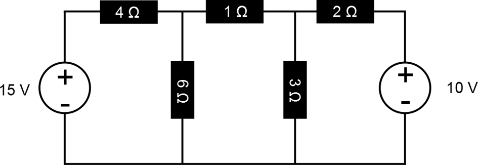
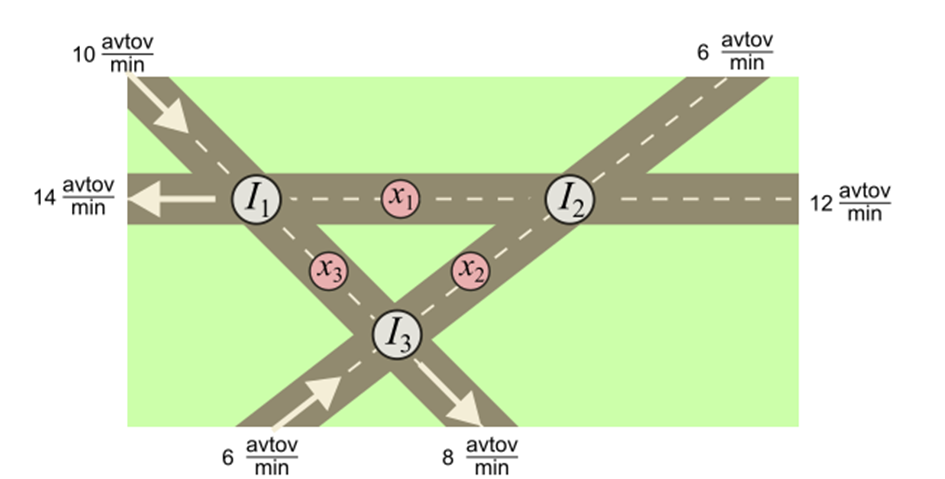

# Gaussova eliminacija

Gaussova eliminacija je numerična metoda za reševanje sistema linearnih enačb oblike:

$$A \mathbf{x} = \mathbf{b}$$

kjer je $A$ matrika koeficientov, $\mathbf{x}$ vektor neznank in $\mathbf{b}$ vektor prostih členov. Metoda temelji na sistematičnem spreminjanju razširjene matrike $[A|\mathbf{b}]$ v zgornje trikotno obliko, iz katere rešitev dobimo s povratno substitucijo.

---

## Teorija

### LU razcep

Gaussova eliminacija je v bistvu LU razcep matrike $A$:

$$A = L \cdot U$$

kjer je:
- $L$ — spodnje trikotna matrika z enicami na diagonali (*lower triangular*)
- $U$ — zgornja trikotna matrika (*upper triangular*)

Med eliminacijo postopoma uničimo elemente pod diagonalo. Za vsak stolpec $j$ in vsako vrstico $i > j$ izračunamo faktor:

$$l_{ij} = \frac{a_{ij}}{a_{jj}}$$

in posodobimo vrstico:

$$a_{ik} \leftarrow a_{ik} - l_{ij} \cdot a_{jk}, \quad k = j, j+1, \ldots, n$$

Po končani eliminaciji matrika $A$ vsebuje $U$, faktorji $l_{ij}$ pa implicitno določajo $L$.

### Pivotiranje

Med eliminacijo se lahko zgodi, da je diagonalni element $a_{jj} = 0$ ali zelo majhen, kar povzroči numerično nestabilnost (deljenje z nič ali izguba natančnosti).

**Delno pivotiranje** (*partial pivoting*) to reši tako, da pred vsako eliminacijo v stolpcu $j$ poiščemo vrstico z največjim absolutnim vrednostjo in jo zamenjamo z vrstico $j$:

$$\text{izberi } k = \arg\max_{i \geq j} |a_{ij}|, \quad \text{nato zamenjaj vrstici } j \text{ in } k$$

To zagotavlja, da so faktorji $|l_{ij}| \leq 1$, kar preprečuje numerično rast napak.

### Povratna substitucija

Ko je matrika $A$ preoblikovana v $U$, rešimo sistem $U\mathbf{x} = \mathbf{b}'$ od spodaj navzgor:

$$x_i = \frac{b'_i - \sum_{k=i+1}^{n} u_{ik} x_k}{u_{ii}}, \quad i = n, n-1, \ldots, 1$$

---

## Implementacija

Projekt vsebuje tri datoteke:

- `Gauss_eliminacija.h` — prototipi funkcij
- `Gauss_eliminacija_vaje.cpp` — implementacija funkcij
- `main.cpp` — primer uporabe

### Funkcije

| Funkcija | Opis |
|---|---|
| `vnesi_matriko_in_vektor(A)` | Interaktivni vnos matrike $A$ in vektorja $\mathbf{b}$ |
| `izpisi_matriko_na_terminal(A)` | Izpis razširjene matrike $[A\|\mathbf{b}]$ v terminal |
| `Gauss_eliminacija(A)` | Izvede LU razcep z delnim pivotiranjem in povratno substitucijo, vrne vektor rešitev |
| `izpis_resitev(R)` | Izpis rešitev $x_1, x_2, \ldots$ |
| `shrani_matriko_v_datoteko(A)` | Shrani matriko v datoteko (ime vnese uporabnik) |
| `preberi_matriko_iz_datoteke(filename)` | Prebere matriko iz datoteke |

---

## Uporaba

### Format datoteke `matrix.dat`

Matrika $A$ in vektor $\mathbf{b}$ sta shranjena skupaj kot razširjena matrika. Vsaka vrstica ustreza eni enačbi, zadnji element v vrstici je vrednost $b_i$. Elementi so ločeni s presledki.

**Primer** — sistem treh enačb:

$$x_1 + 2x_2 + 3x_3 = 17$$
$$2x_1 + 5x_2 + 8x_3 = 44$$
$$3x_1 + 8x_2 + 14x_3 = 76$$

Zapis v `matrix.dat`:

```
1 2 3 17
2 5 8 44
3 8 14 76
```

### Zagon programa

**Windows:**
```sh
gauss.exe
```

**Linux / OS X:**
```sh
./gauss
```

Program najprej vpraša, ali želite vnesti matriko ročno ali jo prebrati iz datoteke `matrix.dat`.

# Domače delo

1. Slika (1) prikazuje shemo električnega tokogroga. Vaša naloga je, da **analitično** in s pomočjo **računalnika** rešitev sistem enačb in določite posamezne tokove, ki tečejo po električnem tokokrogu.


2. Slika (2) prikazuje križišča treh enosmernih ulic. Da bi promet nemoteno potekal, mora biti število avtomobilov, ki vstopijo v križišče v eni minuti, enako številu avtomobilov, ki izstopijo iz križišča. Na primer, v enem izmed križišč vsako minuto vstopi $x_1+10$ avtomobilov in izstopi $x_2+14$. Tako mora za to križišče veljati enačba:
   
$$x_1 + 10 = x_2 + 14$$

Z uporabo Gaussove eliminacije rešite sistem enačb (za spremenljivke $x_1,x_2,x_3$), ki jih dobite iz enačb za posamezna križišča.

 avtomobilov, zato velja enačba:
